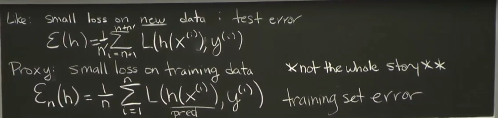

# Training/Testing Error

While closely related, "training error" and "cost function" are not exactly the same in machine learning: "training error" refers to the overall difference between a model's predictions on the training data and the actual values, while a "cost function" is a specific mathematical formula used to quantify that error, often calculated as an average of the errors across all training examples

